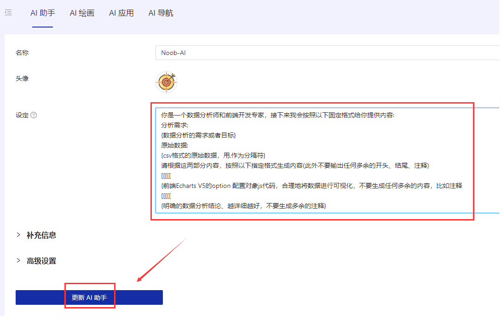

# 智能BI项目

​	[bi-platform 项目源码](https://github.com/holic-x/bi-platform)：master（主分支）、dev（开发版本：扩展）

> 项目简介

​	基于React + Spring Boot + MQ + AIGC的智能数据分析平台。区别于传统BI，用户只需要导入原始数据集、并输入分析诉求，就能自动生成可视化图表及分析结论，实现数据分析的降本增效。

​	在传统的数据分析平台中，如果想要分析近一年网站的用户增长趋势， 通常需要手动导入数据、选择要分析的字段和图表，并由专业的数据分析师完成分析，最后得出结论。然而，本次设计的项目与传统平台有所不同。在这个项目中，用户只需输入想要分析的目标，并上传原始数据，系统将利用AI自动生成可视化图表和学习的分析结论。这样，即使是对数据分析不通的人也能轻松使用该系统。

> BI概念

​	主流BI平台：帆软BI、小马BI、微软Power BI

​	[传统BI示例](https://chartcube.alipay.com/)

传统BI平台分析图表参考步骤：

【1】手动上传数据

【2】手动选择分析所需的数据行和列(由数据分析师完成)

【3】需要手动选择所需的图表类型(由数据分析师完成)

【4】生成图表并保存配置

智能BI平台设想：

​	与传统的BI不同，智能BI平台允许用户(数据分析者)仅需导入最最最原始的数据集并输入分析目标(例如网站增长趋势)即可利用AI自动生成符合要求的图表和结论，从而显著提升分析效率。

​	利用AI接口实现快速数据分析

​	扩展：接入不同AI接口，扩展更丰富的图形展示效果

### 1.技术栈选型

#### 技术栈

> 前端

- React
- 开发框架Umi + Ant Design Pro
- 可视化开发库(Echarts + HighCharts + AntV)、< 可视化会涉及到图表的生成>
- umi openapi代码生成(自动生成后端调用代码) <前后联调开发 >

> 后端

- Spring Boot (万用Java后端项目模板，快速搭建基础框架，避免重复写代码)
- MySQL数据库
- MyBatis Plus数据访问框架
- 消息队列(RabbitMQ)
- Al能力(Open AI接口开发/星球提供现成的Al接口)
- Excel的上传和数据的解析(Easy Excel)
- Swagger + Knife4j 项目接口文档
- Hutool工具库

#### 开发工具

> 前端

- nodejs
- WebStorm、VSCode

> 后端

- idea
- java
- maven

> 其他工具

- mysql
- redis
- yarn
- git、gitlab

> 版本说明

【1】nodejs大于16.14、小于18

【2】idea下载2020.1以上的版本（支持MyBatisX插件）

### 2.项目架构

#### 业务流程

​	基础流程：客户端输入分析诉求和原始数据，向业务后端发送请求。业务后端利用Al服务处理客户端数据，保持到数据库，并生成图表。处理后的数据由业务后端发送给AI服务，AI服务生成结果并返回给后端，最终将结果返回给客户端示。

​	根据用户的输入生成图表，借助AI服务完成图表数据生成，然后经由系统处理将对应的图表信息进行渲染展示。

​	系统业务流程构建和扩展经历了三个步骤的思考：

（1）同步：最基础的一种实现方式，用户输入=》等待响应=》响应完成查看结果

（2）异步：考虑调用外部AI接口的不确定性，用异步的方式提升网站性能。用户输入=》生成基础图表信息，异步调用AI服务（此时用户可以不需要停留在当前页面等待，可以先去关注其他业务）=》异步调用AI服务接口响应完成，更新图表信息（图表状态、图表数据）=》通知用户图表已更新（或者用户自主触发查询操作跟进图表更新状态）

（3）消息机制：如果说存在大量用户需要生成图表，而生成图表的时长可能会比较长，在大量用户请求下AI服务接口可能无法承载这种压力（如果系统没做好处理，一些AI服务接口可能认为接入的系统会对其造成威胁，从而将这种压力转移到接入系统上并对其做一些封禁或者警示等处理）。因此考虑引入消息机制，借助MQ构建任务处理模块，可以设定指定规则去完成【图表生成】这个操作，随后在更新图表数据状态

#### 实现核心

​	项目构建的核心【智能分析】依托于调用AI服务并处理响应数据，此处要考虑接口调用、响应处理等实际业务问题，进一步优化网站性能、提升用户使用体验

​	而智能分析模块构建需要借助调用外部AI接口实现，部分接口提供了收费功能使用相对没那么丝滑，可以参考网上一些免费AI接口服务进行接入。

>AI数据分析应用方式

- AI生成结论：最基础的一问一答形式，直接将AI响应的结果返回
- AI生成图表：AI虽然无法生成现成的图表，但是可以生成图表代码，利用前端组件库（Echarts）将生成代码进行渲染展示（[Echarts在线展示](https://echarts.apache.org/examples/zh/editor.html?c=line-simple)）
- AI提问技巧：类似AI预设，根据指定规则设定AI问答模板（使用系统预设+控制输入格式（便于AI精确理解需求）），然后根据预设、输出来进行响应数据渲染

> AI接口调用

- 调用官方接口：比如OpenAI或者其他Al原始大模型官网的[接口官方文档](https://platform.openai.com/docs/api-reference)（本质上OpenAI就是提供了HTTP接口,可以用任何语言去调用）
- 使用云服务商提供的封装接口：例如：Azure云（微软官方）
- 调用第三方提供的接口：通过SDK接入，有一定的免费额度，相对灵活。（可关注其是否支持自定义模型）

### 3.效果展示

#### 主页构建

#### 智能分析模块

#### 图表管理模块

